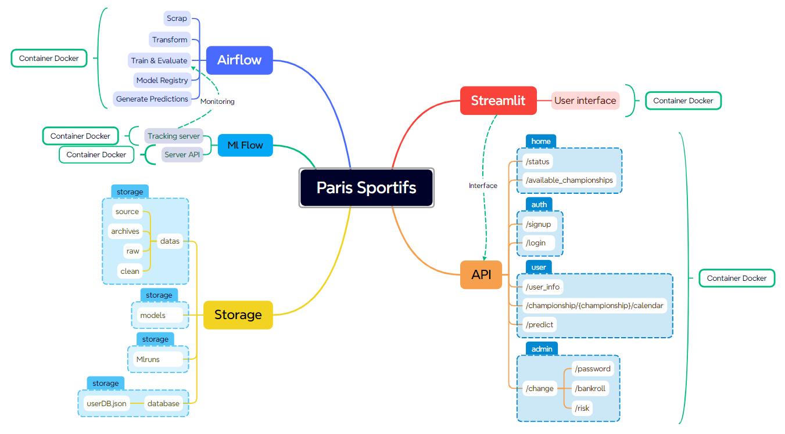
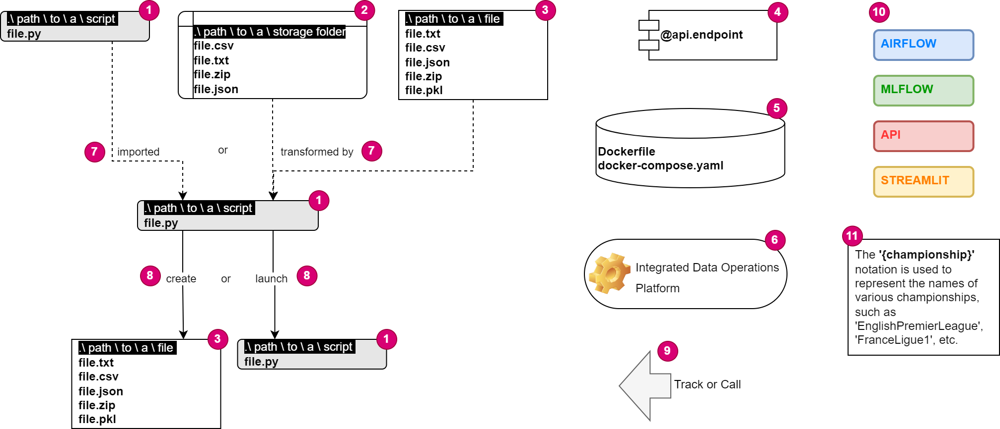
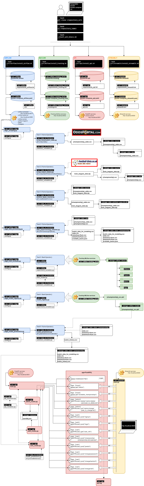
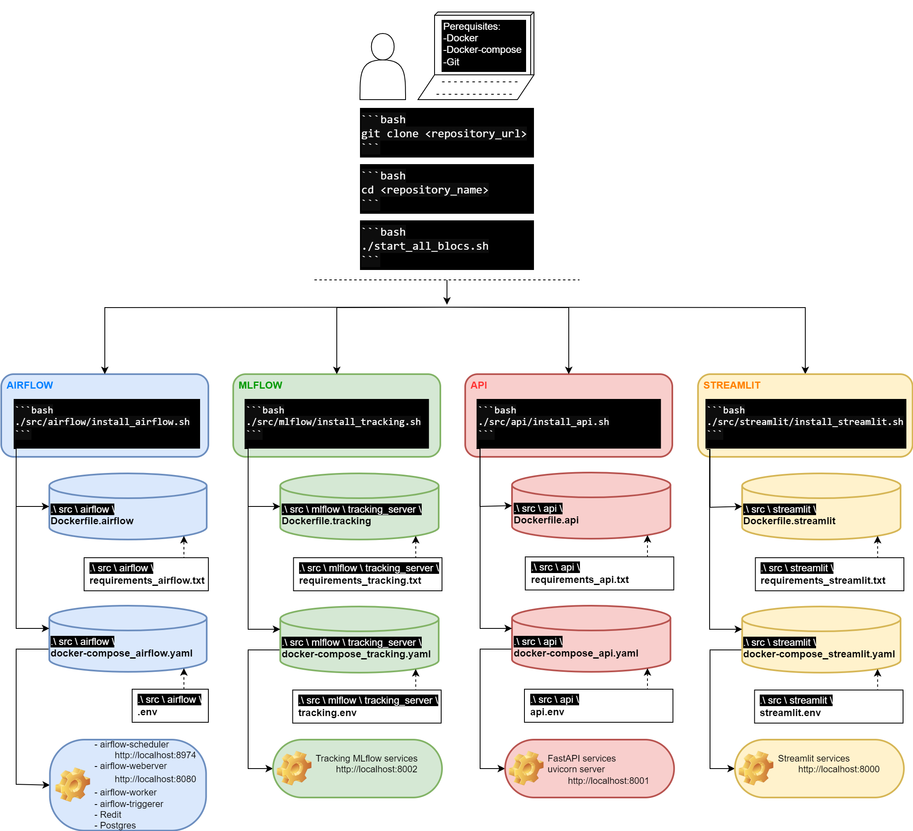
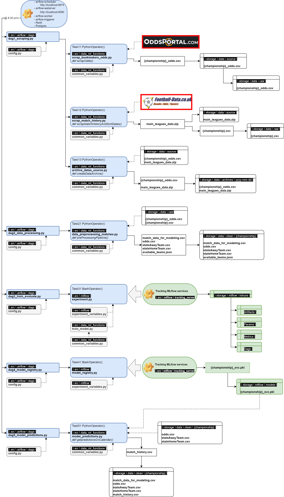
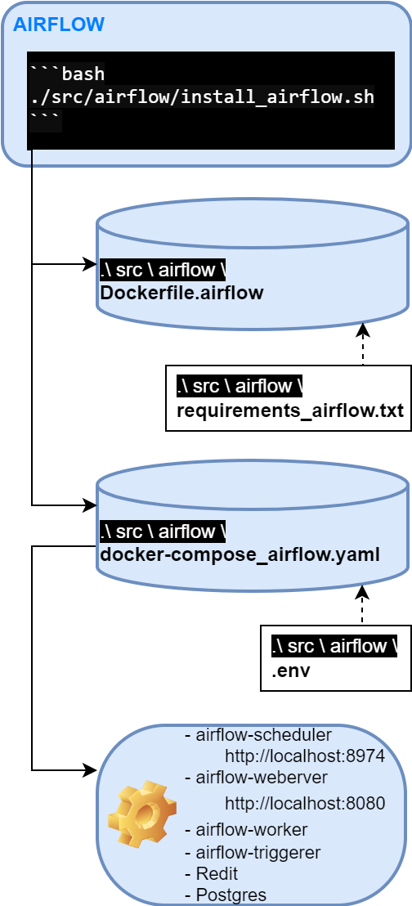
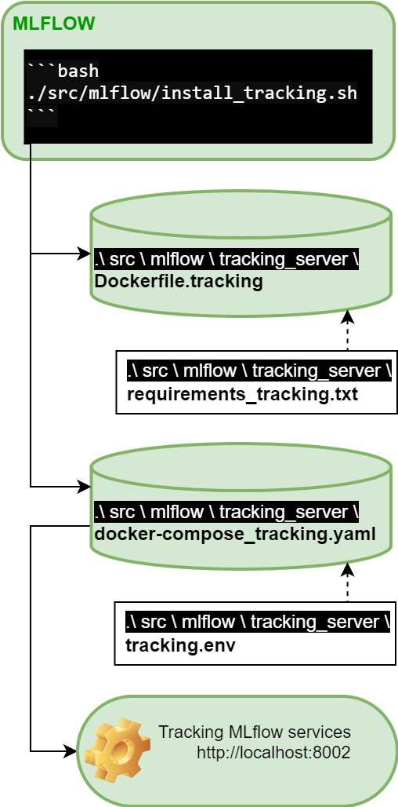
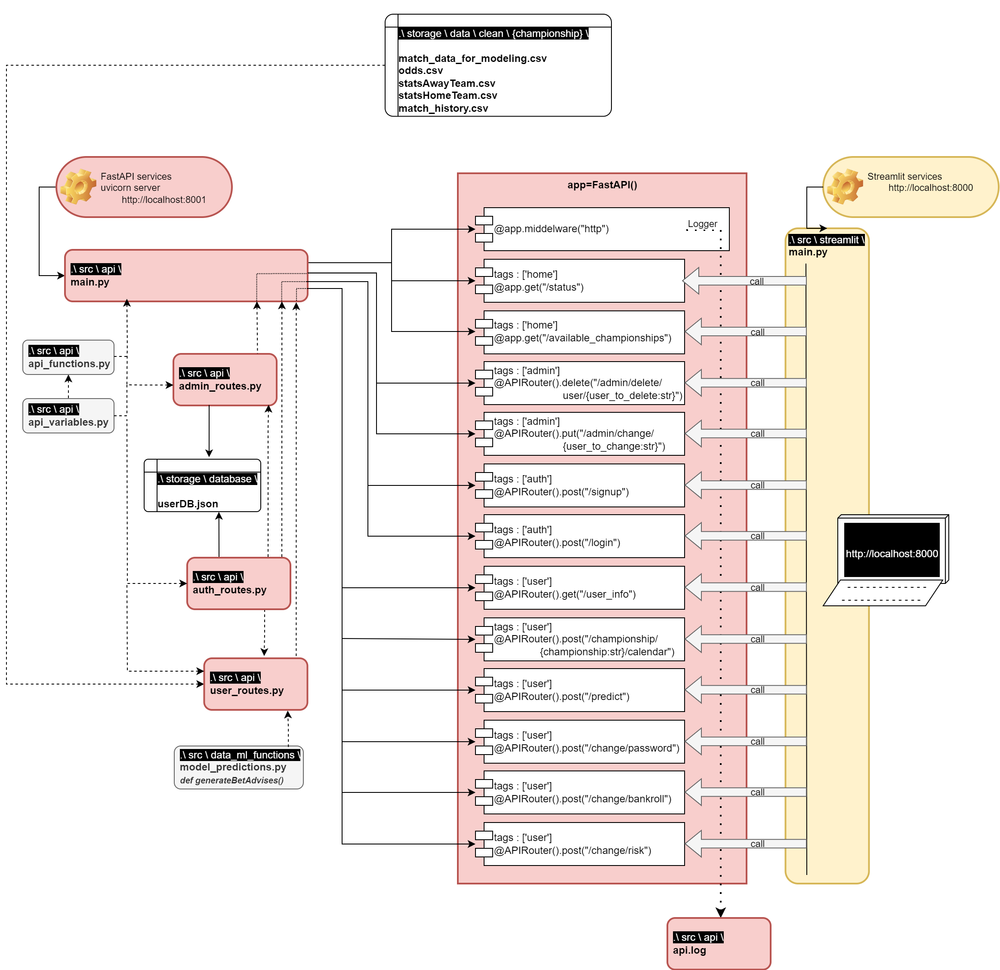
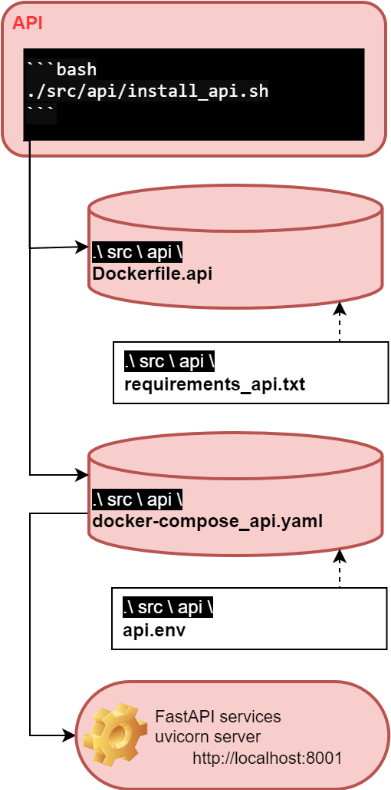
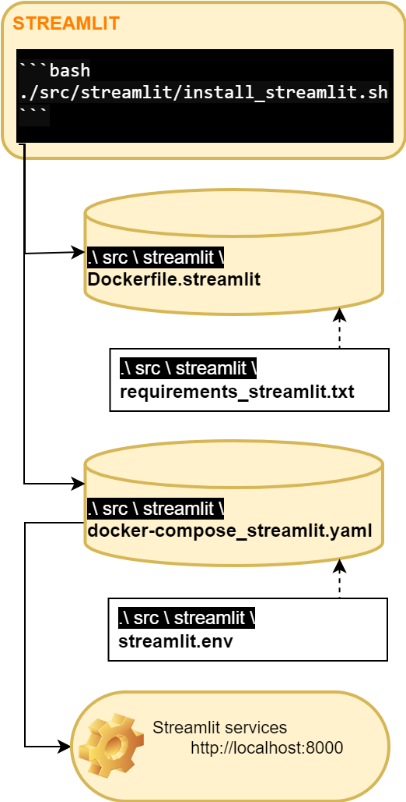

# A Sports Betting Booster API

<p align="center"></p>

**OVERVIEW**

The application is designed to enhance users' chances of winning in sports betting, specifically focusing on various national football championships throughout Europe.

The process to achieve this goal unfolds in three successive stages:

>**1.** Initially, the app prompts users to create a secure account and specify:
>>Their "bankroll," i.e., the total amount of money they are willing to allocate to their betting activities.

--

>**2.** Subsequently, the application employs a Machine Learning model to estimate probabilities or odds for the outcomes of forthcoming matches.

--

>**3.** Lastly, based on statistical analysis, the application determines:
>>- The "value" of a potential bet on upcoming matches. The 'value' of a bet refers to situations where the odds offered are greater than the probability of the event happening. This indicates a bet has a higher expected return on investment than the average, suggesting it is a wise betting opportunity.
>>- The amount of the optimal bet, namely the portion of the bankroll to be risked on this bet, calculated in accordance with the Kelly criterion.

## Table of content

- [1. Data Sources](#1-data-sources)
- [2. Technologies used](#2-technologies-used)
- [3. Repository Architecture and File orchestration](#3-repository-architecture--file-orchestration)
- [4. Quick Start Instructions](#4-quick-start-instructions)
    - [4.1. Prerequisites](#41-prerequisites)
    - [4.2. Configuration Defaults](#42-configuration-defaults)
        - [4.2.1. Default Variables](#421-default-variables)
        - [4.2.2. Customizing defaults](#422-customizing-defaults)
        - [4.2.3. Risk and user role configuration](#423-risk-and-user-role-configuration)
    - [4.3. Steps to launch the application](#43-steps-to-launch-the-application)
    - [4.4. Administrator access](#44-administrator-access)
    - [4.4. What's next ?](#45-whats-next)
- [5. Airflow implementation](#5-airflow-implementation)
    - [5.1. Repository Architecture and File orchestration](#51-repository-architecture-and-file-orchestration)
    - [5.2. Launch instructions](#52-launch-instructions)
    - [5.3. Detailed Airflow deployment with Docker](#53-detailed-airflow-deployment-with-docker)
        - [5.3.1. Building the Docker Airflow Image](#531-building-the-docker-airflow-image)
        - [5.3.2. Docker-compose Setup](#532-docker-compose-setup)
    - [5.4. Key Airflow Files](#54-key-airflow-files-path-srcairflowdag)
        - [5.4.1. 'config.py' Configuration settings and variables](#541-configpy---configuration-settings-and-variables)
        - [5.4.2. 'functions_for_dags.py' Reusable functions for DAGs](#542-functions_for_dagspy---reusable-functions-for-dags)
        - [5.4.3. 'main.py' Main DAG Definitions](#543-mainpy---main-dag-definitions)
- [6. MlFlow](#6-mlflow)
    - [6.1. Repository Architecture and File orchestration](#61-repository-architecture-and-file-orchestration)
    - [6.2. Launch instructions](#62-launch-instructions)
    - [6.3. Setting up the MlFlow tracking server with Docker](#63-setting-up-the-mlflow-tracking-server-with-docker)
        - [6.3.1. 'Dockerfile.tracking' file highlights](#631-dockerfiletracking-highlights)
        - [6.3.2. 'docker-compose_tracking.yaml' file highlights](#632-docker-compose_trackingyaml-highlights)
    - [6.4. Experiment management and model registry workflow](#64-experiment-management-and-model-registry-workflow)
        - [6.4.1. 'experiment_variables.py' file highlights](#641-experiment_variablespy)
        - [6.4.2. 'experiment.py' file highlights](#642-experimentpy)
        - [6.4.3. 'model_registry.py' file highlights](#643-model_registrypy)
- [7. API Implementation](#7-api-implementation)
    - [7.1. Repository Architecture and File orchestration](#71-repository-architecture-and-file-orchestration)
    - [7.2. Launch Instructions](#72-launch-instructions)
    - [7.3. Detailed API service deployment with docker](#73-detailed-api-service-deployment-with-docker)
        - [7.3.1. Building the API Docker Image](#731-building-the-api-docker-image)
        - [7.3.2. Docker-compose setup](#732-docker-compose-setup)
    - [7.4. Key API files](#74-key-api-files)
        - [7.4.1. 'api_variables.py' file highlights](#741-api_variablespy)
        - [7.4.2. 'api_functions.py' file highlights](#742-api_functionspy)
        - [7.4.3. 'admin_routes.py' file highlights](#743-admin_routespy)
        - [7.4.4. 'auth_routes.py' file highlights](#744-auth_routespy)
        - [7.4.5. 'user_routes.py' file highlights](#745-user_routespy)
        - [7.4.6. 'main.py' file highlights](#746-mainpy)
- [8. Streamlit](#8-streamlit)
    - [8.1. Repository Architecture and File orchestration](#81-repository-architecture-and-file-orchestration)
    - [8.2. Launch instructions](#82-launch-instructions)
    - [8.3. Deploying the Streamlit Application with Docker](#83-deploying-the-streamlit-application-with-docker)
        - [8.3.1. 'dockerfile.streamlit' file highlights](#831-dockerfilestreamlit-highlights)
        - [8.3.2. 'docker-compose_streamlit.yaml' file highlights](#832-docker-compose_streamlityaml-highlights)
    - [8.4. Streamlit interface for football match prediction](#84-streamlit-interface-for-football-match-prediction)
        - [8.4.1. 'main.py' file streamlit application overview](#841-mainpy-streamlit-application-overview)
- [9. Github actions : Continuous integration and deployment (CI/CD) workflow](#9-github-actions--continuous-integration-and-deployment-cicd-workflow)
    - [9.1. Overview](#91-overview)
    - [9.2. Container tests](#92-container-tests)
    - [9.3. Data ML functions tests](#93-data-ml-functions-tests)
    - [9.4. API tests](#94-api-tests)
- [10. Data Storage](#10-data-storage)
    - [10.1. Repo Architecture ](#101-repo-architecture)
- [11. Credits](#11-credits)


## 1. Data Sources

The API's data analysis draws on two distinct sources:

- The primary source is https://www.football-data.co.uk/, which offers downloadable CSV files. These files are updated daily with results from the current season for various national football championships worldwide. Results from previous seasons are also available for download. The architecture of the CSV files is detailed here : https://www.football-data.co.uk/notes.txt. Relevant features for our purposes include match statistics such as Match Date, Full Time Result, Full Time Home Team Goals, Full Time Away Team Goals, and odds from 13 different bookmakers. Our machine learning model uses this data to predict the outcomes of future matches.

- The second source is https://www.oddsportal.com/, which provides future betting odds. We employ web scraping techniques to collect this data, which is essential for identifying bets with value according to the Kelly criterion.

## 2. Technologies used

- **Python**: The core programming language for the project, enabling the development of machine learning models, data processing, and the creation of the API server.
- **FastAPI**: Utilized as the web framework for developing the API. FastAPI is known for its high performance and ease of use for creating web services.
- **Streamlit**: Employed to construct an interactive user interface, Streamlit simplifies the process of turning data scripts into shareable web apps.
- **MLflow**: An open-source platform used to manage the full lifecycle of the machine learning process, including model training and deployment. MLflow facilitates tracking  experiments, packaging code into reproducible runs, and sharing findings.
- **Airflow**: An open-source tool for orchestrating complex computational workflows and data processing pipelines. In this project, Airflow automates the machine learning pipeline, encompassing tasks such as data collection, preprocessing, model training, and updating predictions.  
- **Docker**: Used to containerize the applications, including FastAPI, Streamlit, and Airflow, along with their dependencies. Docker ensures that the software runs reliably when moved from one computing environment to another.

Orchestration between these technologies is depicted in the following figure :



## 3. Repository Architecture & File Orchestration

The following two chapters aim to provide an overview of the project by first presenting a macro-level view of the repository architecture, followed by illustrating the data flow intelligence of our project. This includes the interaction between data sources, utilized technologies, and the main files and folder locations within the repository.

### 3.1. Repository Architecture

This section outlines the hierarchical structure of the main repository, highlighting key directories and files:

    ├── README.md
    │
    ├── start_all_blocs.sh
    ├── stop_all_blocs.sh
    │
    ├── .github
    │   └── workflows
    │
    ├── src
    │   │
    │   ├── airflow 
    │   │       └── & subfolders            
    │   │              
    │   ├── api           
    │   │                        
    │   ├── data_ml_functions
    │   │          
    │   ├── mlflow
    │   │       └── & subfolders
    │   │          
    │   └── streamlit
    │   
    └── storage
        │
        ├── data 
        │   ├── archives
        │   ├── clean
        │   ├── raw
        │   └── source
        │
        ├── database
        │
        ├── mlflow
        │
        └── models

### 3.2. File orchestration

Below is a diagram illustrating the data processing flow, showcasing how information is exchanged between various data sources, the technologies we employ, and the main file and folder locations in our repository.

**Please note:** Parts of this diagram will be detailed further in the subsequent sections, with a special emphasis on the legend detailed in the following figure. This will help clarify the roles and relationships of different components within our system, ensuring a comprehensive understanding of our processes and methodologies.

------------------------------------
**LEGEND**

------------------------------------
**FIGURE**

------------------------------------

## 4. Quick start instructions

To ensure a smooth and efficient setup, this chapter begins with a specific diagram that zooms into the file orchestration relevant to getting your application up and running. This diagram is a detailed part of the general orchestration illustrated at the beginning of our documentation. It specifically highlights the components and processes involved in the quick start and setup phase, providing clarity on how these elements interact within our system's broader context.

Before diving into the details, let's get your application running with a few simple steps. This guide assumes you have Docker installed on your system. If not, please install Docker from docker.com first.



### 4.1. Prerequisites
- Docker
- Docker Compose (v >2.14.0)
- Git (optional, for cloning the repository)

### 4.2. Configuration Defaults
The application comes pre-configured with a set of default variables to help you get started quickly. These defaults are designed to provide a meaningful out-of-the-box experience and can be easily customized to fit your preferences or requirements.

#### 4.2.1. Default Variables
- Current Season: Set to ***"2023-2024"***. This is the season the application will analyze and make predictions for by default.
- Championships: The application focuses on the following championships by default: ***"English Premier League"*** and ***"France Ligue 1"***. These selections are based on availability and popularity but can be adjusted as needed.
- Other Variables: Additional defaults include settings for data sources, ML model parameters, and betting thresholds. These are optimized for a balance between accuracy and performance.

#### 4.2.2. Customizing Defaults
To customize these variables, navigate to the docker-compose_airflow file located in <src\airflow\docker-compose_airflow.yaml>. Here, you can update the default values to reflect the championships, seasons, or other parameters you're interested in.

Exemple :
```python
CURRENT_SEASON: '2324' # <---- Change season if needed
CHAMPIONSHIPS: "English Premier League,France Ligue 1"
```

#### 4.2.3. Risk and User Role Configuration
- **Risk Levels:** Navigate to `src/api/api_variables.py` to set the allowed risk values (`low`, `medium`, `high`). These settings influence the Kelly criteria modulations for betting risk management.
- **User Roles:** Within the same file, you can define user role values (`0`, `1`, `9`) that determine the access level to the API features, including prediction access, premium features, and administrative capabilities.

### 4.3. Steps to Launch the Application
**1.** Clone the repository (optional):
If you haven't already, clone the repository to your local machine using:

```bash
git clone <repository_url> 
```

Navigate to the cloned repository directory:

```bash
cd <repository_name>
```

**2.** Launch components:
To fully launch the application, it's essential to start the 4 independent blocks as described below:
- API Container
- Airflow Container
- MLflow Tracking Server Container
- Streamlit Container

Run the `start_all_blocs.sh` script to initiate the API, Streamlit UI, MLflow Tracking Server, and Airflow containers. This script orchestrates the setup of the containers and ensures that all necessary services are operational.

To execute the script, use the following command in your terminal:

```bash
./start_all_blocs.sh
```

**3.** Verify Container Status:
Once the script completes, it will output the currently running containers. Ensure all the expected containers for the API, Streamlit, MLflow, and Airflow are listed and running.

You can manually check the running containers at any time with:

```bash
docker container ls
```

### 4.4. Administrator Access

For administrative purposes, the login and password are initially set in the `install_airflow.sh` script and subsequently copied to the `.env` file located in `<src/airflow>`. Ensure to secure this information and change the default credentials as needed to maintain the integrity of the system.

### 4.5. What's Next?
After starting the application, you can access:

- The Airflow web interface at http://localhost:8080

- The MLflow Tracking Server at http://localhost:8002

- The API documentation at http://localhost:8001/docs

- The Streamlit UI at http://localhost:8000

For detailed instructions on using each component, refer to the corresponding sections of this README.

- [Airflow](#5-airflow-implementation)
- [MLflow](#6-mlflow)
- [API](#7-api-implementation)
- [Streamlit](#8-streamlit)

## 5. Airflow implementation
### 5.1. Repository Architecture and File orchestration
As we explore the specifics of our Airflow implementation, it becomes crucial to appreciate both the detailed orchestration within Airflow and its integration into the larger data processing ecosystem of our project. This understanding is facilitated by visual aids that include a detailed diagram of the Airflow repository architecture and a broader orchestration figure that we initially introduced. However, it's important to note that our visual depiction does not strictly separate Airflow from MLflow components due to their intertwined functionalities and collaborative role in our system.

**Repository Architecture Diagram:**
First, let's focus on the Airflow-specific components. Below is a detailed diagram showcasing the structure of our Airflow repository. This diagram illustrates how various scripts and configurations are organized to facilitate data processing workflows. Understanding this structure is pivotal for navigating, modifying, or enhancing our Airflow pipelines.

    src   
    │
    └── airflow
            │   
            ├── dags            
            │   ├── config.py               <- Houses configuration settings and variables that are used across different DAGs.
            │   ├── dag1_scraping.py        <- Initiates the data scraping process, collecting raw data from predefined sources.
            │   ├── dag2_data_preprocessing.py  <- Handles data cleaning and preprocessing tasks, preparing the data for model training.
            │   ├── dag3_train_evaluate.py      <- Manages model training and evaluation, utilizing the preprocessed data to generate and assess models.
            │   ├── dag4_model_registry.py      <- Registers the trained models, storing them for future reference and deployment. 
            │   └── dag5_model_predictions.py   <- Deploys the registered models to make predictions on new or existing data. 
            │      
            ├── docker-compose_airflow.yaml <- To deploy Apache Airflow using Docker Compose.
            ├── .env                        <- Airflow configuration including image name, user IDs, and default web UI credentials.
            ├── Dockerfile.airflow          <- To define the Docker environment for Airflow.
            ├── install_airflow.sh          <- To automate the installation process for Airflow, setting up the necessary environment and dependencies.
            ├── requirements_airflow.txt    <- List of packages installed when running Dockerfile.airflow
            └── uninstall_airflow.sh        <- To clean up the Airflow installation, removing the environment and dependencies.

**Reference to the File Orchestration Figure:**
Moreover, to fully grasp Airflow's role within our comprehensive data processing strategy, we encourage revisiting the file orchestration figure presented at the outset of this documentation. This broader perspective underlines Airflow's pivotal function in orchestrating data movement and transformation through various project phases, from initial ingestion to final prediction. It also subtly incorporates MLflow's integral contributions, showcasing the seamless collaboration between these two vital components. This integrated approach underscores the symbiotic relationship between Airflow and MLflow in our project, reinforcing the importance of understanding both tools in tandem to appreciate the full scope of our data processing and machine learning lifecycle.



### 5.2. Launch instructions
- Prerequisites: Confirm that Docker and docker-compose are installed and properly configured on your system. This is a necessary step before proceeding with the Airflow setup.

<p align="center"></p>

- Using `install_airflow.sh`: This script automates several setup tasks:
    - Copies DAG and MLFlow files to their respective directories.
    - Sets environment variables necessary for Airflow's operation and the Docker image configuration.
    - Defines default credentials for the Airflow webserver, which can be customized according to your security preferences.
    - Adjusts folder permissions, though it's recommended to review these permissions to ensure they meet your security standards.
    - Builds a custom Docker image for Airflow and starts the service using docker-compose.

- Configuration Customization: Check the `docker-compose_airflow.yaml` file for configurations of environment variables such as the DAG scheduler, championships, and paths to storage locations. You can modify these variables (e.g., `dag_schedule_<dag_name>`) according to your needs. The default value for each is set to None.

- Starting Airflow: Execute the command `./install_airflow.sh` to run Airflow. The setup script ensures that each DAG triggers the subsequent one in the following order: 
    dag1 >> dag2 >> dag3 >> dag4 >> dag5. This sequence is vital for the intended workflow execution.

- Reverting Changes: Should you need to remove all changes and clean up the Airflow installation, use the command `./uninstall_airflow.sh`. This script will help maintain a clean environment by undoing the setup actions performed earlier.

### 5.3. Detailed Airflow deployment with Docker
#### 5.3.1. Building the Docker Airflow Image

To tailor the Apache Airflow environment to our specific needs, particularly for web scraping tasks, we've crafted a custom Docker image as defined in `Dockerfile.airflow`. This custom image builds upon the official `apache/airflow:latest-python3.10` image, introducing additional packages, configurations, and permissions adjustments necessary for our workflows.

Key Steps in `Dockerfile.airflow`:

- **Base Image**: Starts with `apache/airflow:latest-python3.10`, offering a modern Python environment.
- **Privilege Management**: Temporarily switches to the root user to install dependencies and adjust file permissions, ensuring both security and functionality.
- **Firefox Installation**: Installs `firefox-esr` to enable web scraping tasks, alongside permissions adjustments for the `geckodriver`, essential for Selenium-based scraping.
- **Python Environment**: Copies local DAGs and MLflow configuration into the container, and installs additional Python packages from `requirements_airflow.txt` to support our data processing and ML workflows.
- **Environment Configuration**: Adds Airflow and DAGs directories to `PYTHONPATH`, facilitating Python's recognition of custom modules and scripts contained within these paths.

This Dockerfile is crucial for creating an Airflow environment that's pre-configured for our project's unique data engineering and analysis requirements.

#### 5.3.2. Docker-compose setup
Our project utilizes Docker Compose for orchestrating and managing the multi-container Docker application environment. The `docker-compose_airflow.yaml` file is at the heart of this setup, defining and configuring all the necessary services, volumes, and networks to run Apache Airflow along with its dependencies such as Postgres for the metadata database and Redis for messaging.

Key Components of `docker-compose_airflow.yaml`:

- **Airflow Services**: Includes the webserver, scheduler, worker, and triggerer, each configured with health checks and restart policies to ensure high availability and resilience.
- **Database and Messaging**: Uses Postgres and Redis, respectively, for Airflow's metadata storage and task messaging, with custom configurations for performance and security.
- **Initial Setup and Configuration**: Features an `airflow-init` service that prepares the environment, performing tasks like database migrations and creating default users to ensure a smooth first-time setup.
- **Custom Environment Variables**: Defines numerous environment variables for fine-tuning Airflow's behavior and integrating custom features or paths for data, models, and more.

This setup is designed to be scalable and flexible, accommodating a range of deployment scenarios from development to production.

### 5.4. Key Airflow files Overview
#### 5.4.1. `config.py` - Configuration Settings and Variables
This file is crucial for setting up environment-specific variables and configurations used throughout the Airflow DAGs. It extracts values from the environment to configure DAG schedules, email alerts, and other important settings. Here are some of the core configurations:

- DAG Schedules: Variables like dag_scheduler_scraping and dag_scheduler_model_predictions determine the scheduling of various DAGs, making your workflows dynamic and adaptable to different environments.
- Alerts: Setup for failure alerts via email, including sender and receiver email addresses, mail server configuration, and credentials. This ensures prompt notification in case of task failures.
- Scraping Configuration: Variables like url, filename, dictionary, and league are set up for the scraping tasks, focusing specifically on main leagues.

#### 5.4.2. DAG Files Structure
Each DAG file follows a structured approach to define and execute tasks:

- Import necessary libraries and modules, including Airflow components and configuration variables from `config.py`.
- Define the DAG, including its ID, description, tags, schedule interval, and start date.
- Create tasks using appropriate Airflow operators, configuring retries, retry delays, and documentation as markdown for clarity.
- Specify task dependencies and, if applicable, configure DAG triggers to orchestrate the workflow across different stages.

## 6. MLFLOW
### 6.1. Repository Architecture and File orchestration
MLflow is a pivotal component in our machine learning lifecycle, offering comprehensive capabilities for managing experiments, tracking models, and streamlining the deployment process. 

**Repository Architecture Diagram:**
Here, we delve into the MLflow repository architecture, highlighting the essential directories and files that constitute our MLflow setup. Each element within this structure plays a specific role in ensuring the seamless operation of the MLflow Tracking Server, from logging experiments and parameters to managing the lifecycle of our models.

    src   
    │
    └── mlflow
        │  
        ├── tracking-server     <- Houses files necessary for the MLflow Tracking Server, which logs experiments, parameters, and results.
        │       │
        │       ├── install_tracking.sh     <- Script for building the Docker image and launching the MLflow Tracking Server via Docker Compose.
        │       ├── uninstall_tracking.sh   <- Script to halt and clean up the Docker containers and images associated with the MLflow Tracking Server.
        │       │
        │       ├── Dockerfile.tracking     <- Dockerfile to build the image for the MLflow Tracking Server, specifying the environment and entry point.
        │       ├── requirements_tracking.txt   <- Specifies Python package dependencies for the MLflow Tracking Server environment.
        │       │
        │       ├── docker-compose_tracking.yaml    <- Docker Compose YAML file for setting up the MLflow Tracking Server container.
        │       └── tracking.env            <- Environment variables for tracking service, including host, port, and MLflow tracking URI.
        │
        ├── experiment_variables.py     <- Defines variables used across experiments, such as tracking URIs and model paths. 
        │
        ├── experiment.py   <- Contains the logic for running experiments, including model training, evaluation, and logging with MLflow.
        │
        └── model_registry.py   <- Manages the MLflow Model Registry interactions, including model tagging and setting production aliases.

**Reference to the File Orchestration Figure:**
Given the intricate integration between MLflow and Airflow within our project, we utilize the same diagram introduced in the Airflow chapter to depict the operational flow and structure of MLflow. This decision underscores the intertwined nature of these components and their collective role in our system's architecture.

This shared diagram provides a comprehensive view, illustrating not only the MLflow component but also its relationship with Airflow, showcasing the synergy between experiment tracking, model evaluation, registry management, and workflow orchestration. Through this visual representation, you will see how MLflow and Airflow collaborate to enhance our machine learning operations, ensuring efficient management and deployment of models.
([see section 5.1.](#51-repository-architecture-and-file-orchestration))

### 6.2. Launch instructions
- Prerequisites: Confirm that Docker and docker-compose are installed and properly configured on your system. This is a necessary step before proceeding with the API deployment.

<p align="center"></p>

- Execute the `install_tracking.sh` script to automate the deployment process. This script performs the following actions:
    - Copies necessary data files to the current directory.
    - Builds the Docker image for the API using `Dockerfile.tracking`.
    - Starts the API container in detached mode using Docker Compose.

Run the following command from the mlflow directory:
```bash
./install_tracking.sh
```  

Confirm that the mlflow container is running using:  
```bash
docker container ls
```

- To stop and remove the mlflow container and its associated image, use the `uninstall_tracking.sh` script. This script ensures a clean removal of the components:
```bash
./uninstall_tracking.sh
```  
This will stop the mlflow container, remove it along with its image, and output a confirmation message.

### 6.3. Setting Up the MLflow Tracking Server with Docker
#### 6.3.1. `Dockerfile.tracking` Highlights

- **Base Image**: Utilizes `python:3.10` as the base image, ensuring a Python 3.10 environment for consistency and compatibility with your MLflow and other Python-based dependencies.
- **Working Directory**: Sets `/app` as the working directory within the container. This directory serves as the primary location for your application code and dependencies.
- **Dependencies Installation**: Copies `requirements_tracking.txt` into the container and installs Python dependencies listed within. This step is crucial for preparing the environment with necessary libraries, including MLflow.
- **Application Code**: Copies the entire project directory (`.`) into `/app` in the container. This action ensures all your application files are available within the Docker container.
- **Exposed Port**: Exposes port `8002`, which is the designated port for the MLflow Tracking Server. This port must be mapped accordingly in the Docker Compose file to enable access from the host.
- **Environment Variables**: Sets `PYTHONPATH` to `/app`, helping Python to recognize your application directory for module imports.
- **Startup Command**: Uses `mlflow server` command with environment variables `$MLFLOW_TRACKING_URI`, `$HOST`, and `$PORT` to start the MLflow Tracking Server. These variables should be defined in the `tracking.env` file or passed at runtime.

#### 6.3.2. `Docker-compose_tracking.yaml` Highlights
- **Version**: Specifies version 3 of the Docker Compose file format, ensuring compatibility with Docker Engine releases supporting Compose file version 3.

- **Service Configuration**:
    - **Image**: Uses `paris_sportifs_mlflow_tracking_server:latest` for the MLflow container image. This should be built from the Dockerfile described above.
    - **Container Name**: Names the container `MLFLOW_Container`, providing a recognizable label for management (e.g., starting, stopping).
    - **Environment File**: Incorporates `tracking.env`, which should define environment variables such as `HOST`, `PORT`, and `MLFLOW_TRACKING_URI`.
    - **Port Mapping**: Binds port `8002` on the host to port `8002` on the container, aligning with the exposed port in the Dockerfile. Adjust as needed for different configurations.
    - **Networks**: Connects the container to a custom network named `mlflow_network`, facilitating communication with other services within the same network.
    - **Restart Policy**: Configured to `always`, ensuring the container restarts automatically upon exit or reboot.
    - **Healthcheck**: Implements a health check using curl to verify the MLflow Tracking Server's availability at `localhost:8002`. Adjustments may be necessary based on the container and network configuration.
    - **Volumes**: Mounts local storage paths to the container, providing persistent storage for models (`../../../storage/models`) and MLflow data (`../../../storage/mlflow`). These paths should be absolute or relative to the Docker Compose file location.

### 6.4. Experiment Management and Model Registry Workflow
Further into this chapter, we'll explore how to manage experiments and handle model registry workflows using the outlined MLflow architecture. This section is designed to guide you through the practical application of MLflow in your projects, enhancing your ability to track, evaluate, and deploy machine learning models efficiently.

#### 6.4.1. `experiment_variables.py`
This file centralizes the configuration of your MLflow experiments, making your project more modular and easier to manage. Key variables include:

- **tracking_uri**: The URI for the MLflow tracking server, which logs experiments and model metrics. By default, it points to `'../../storage/mlflow/mlruns/'`.
- **minimal_accuracy**: A threshold for model performance, below which models may not be considered for production. The default value is `0.5`.
- **championships**: A list of championships (e.g., 'English Premier League, France Ligue 1') to be used in model training and evaluation.
- **path_to_model**: The file path where trained models are saved. This ensures models are stored in a consistent location.

#### 6.4.2. `experiment.py`
This script orchestrates the training and evaluation process for your models, utilizing MLflow for tracking and logging:

- Sets the MLflow tracking URI to log experiments.
- Iterates over a predefined list of championships, training models for each.
Logs key information such as parameters, metrics, and artifacts (e.g., confusion matrices) to MLflow.
- Conditionally tags runs as 'good' or 'bad' based on their accuracy relative to `minimal_accuracy`.
- Uses `mlflow.sklearn.log_model` to log the trained model, facilitating easy deployment and versioning.

#### 6.4.3. `model_registry.py`
Responsible for managing the MLflow Model Registry, this script automates the tagging and deployment of models:

- Connects to the MLflow tracking server to access the Model Registry.
- Lists all registered models, evaluating each version based on its performance metrics.
- Tags model versions as 'good' or 'bad' depending on whether their accuracy surpasses the `minimal_accuracy` threshold.
- Determines the "best" model version for each championship based on accuracy, promoting it to the "production" stage.
- Saves the best model to a specified path, making it ready for deployment.


## 7. API implementation
### 7.1. Repository Architecture and File orchestration

**Repository Architecture Diagram:**
The structure of our repository is designed to facilitate the efficient development and deployment of our API. Here's a breakdown of the key directories and files within the src/api section:

    src   
    │
    └── api  
        │
        ├── __init__.py             <- Initializes API directory as a Python package
        ├── unit_test.py            <- Related to CI/CD worklow (see chapter #9 for details)
        │
        ├── api_variables.py        <- Global variables and configuration settings  
        ├── api_functions.py        <- Utility functions used across the API
        ├── admin_routes.py         <- Defines administrative operations routes
        │     
        ├── user_routes.py          <- Routes for user functionality within the API
        ├── auth_routes.py          <- Authentication and authorization routes
        │
        ├── main.py                 <- Entry point to the FastAPI application
        │
        ├── docker-compose_api.yaml     <- Orchestrates Docker containers for the API
        ├── api.env                     <- Configuration settings for the API service container, including port, database, and data paths. 
        ├── Dockerfile.api              <- Specifies the Docker environment for the API
        ├── install_api.sh              <- Script to deploy the API using Docker
        ├── uninstall_api.sh            <- Script to remove Docker containers and images
        └── requirements_api.txt        <- Lists dependencies for the API

**Reference to the File Orchestration Figure:**
To provide a comprehensive visual representation of how files interact within our API and its integration with Streamlit, we include a diagram detailing the orchestration of key files. This diagram does more than illustrate the relationship between various components; it also highlights the strong imbrication between the API and Streamlit, enhancing the understanding of the operational flow within our system. Given the tight integration between the API and Streamlit components, this visual guide aids in appreciating how changes or updates to one part may impact the other, ensuring developers and users alike can navigate our architecture with greater insight.

The specifics of these interactions, including the role each file and component plays in our ecosystem, will be thoroughly elaborated on in the following sections. This will offer clarity on the diagram’s components, ensuring a deep understanding of our system’s internal workings and how they contribute to our application’s functionality.



### 7.2. Launch instructions
- Prerequisites: Confirm that Docker and docker-compose are installed and properly configured on your system. This is a necessary step before proceeding with the API deployment.

<p align="center"></p>

- Execute the `install_api.sh` script to automate the deployment process. This script performs the following actions:
    - Copies necessary data files to the current directory.
    - Builds the Docker image for the API using `Dockerfile.api`.
    - Starts the API container in detached mode using Docker Compose.

Run the following command from the API directory:
```bash
./install_api.sh
```

Confirm that the API container is running using:
```bash
docker container ls
```

- To stop and remove the API container and its associated image, use the `uninstall_api.sh` script. This script ensures a clean removal of the components:
```bash
./uninstall_api.sh
```
This will stop the API container, remove it along with its image, and output a confirmation message.

### 7.3. Detailed API Service Deployment with Docker
#### 7.3.1. Building the API Docker Image
The creation of a bespoke environment for our API is outlined in `Dockerfile.api`, detailing the steps to build a Docker image tailored for our API service. This file is instrumental in setting up an isolated and reproducible environment that's optimized for performance and reliability.

Key Aspects of `Dockerfile.api`:

- **Base Image and Environment**: Begins with `python:3.10` as the foundation, offering a lightweight and efficient Python runtime.
- **Dependencies Installation**: Employs a requirements file (`requirements_api.txt`) to install specific Python packages needed for the API to function, ensuring a clean and minimal build.
- **Application Setup**: Copies the API's codebase into the container, arranging files within the `/app` directory to match the expected structure, facilitating ease of access and execution.
- **Service Exposure and Environment Variables**: Exposes port `8001` for network communication and sets `PYTHONPATH` to include our API directory, streamlining module discovery and import processes.
- **Execution Command**: Utilizes `uvicorn` as the ASGI server to launch the API, dynamically reading host and port settings from environment variables, allowing for flexible deployments.

Through `Dockerfile.api`, we define a clear and efficient process for creating a Docker image that encapsulates our API, ensuring it's ready to be deployed in any Docker-compatible environment.

#### 7.3.2. Docker-compose setup
To seamlessly deploy and manage our API service, we leverage Docker Compose, encapsulated in the `docker-compose_api.yaml` file. This configuration is dedicated to containerizing and orchestrating our custom-built API, ensuring it's neatly packaged, easily deployable, and scalable alongside the necessary environment and network configurations.

Key Features of `docker-compose_api.yaml`:

- **API Container Definition**: Central to this setup is the `container_api` service, utilizing our custom `paris_sportifs_api:latest` image to run the API server.
- **Environment Variables Configuration**: Critical for tailoring the API's behavior, variables such as `UVICORN_HOST`, `UVICORN_PORT`, database paths, and security settings are specified, with distinct settings for development and production environments.
- **Port Mapping and Volumes**: Ensures the API service is accessible on specified ports and that essential data, models, and configuration files are mounted from the host, facilitating data persistence and easy updates.
- **Network Configuration**: Utilizes a dedicated network (`api_network`), allowing the API service to communicate securely with other services within a defined network space.
- **Health Checks and Restart Policies**: Implements health checks to monitor the API's availability and automatically restart the service if it becomes unresponsive, ensuring high availability.

This Docker Compose configuration simplifies the deployment of our API service, making it straightforward to scale and maintain within diverse environments.

### 7.4. Key API files
#### 7.4.1. `api_variables.py`
The `api_variables.py` file centralizes configuration settings and common variables that support the operational aspects of the Sports Betting Booster API. It includes environment variables, model definitions, and HTTP exceptions used throughout the API.

**Configuration and Environment Variables**
- `prod_processing_environment`: Determines the operational environment of the API, affecting logging and other environment-specific behaviors.
- `user_database`: Path to the JSON file used as the database for storing user information.
- `api_versions`: Lists the versions of the API that are available and supported.
- `allowed_type_risk`, `allowed_roles_values`, and `admin_role`: Define valid values for user risk levels, roles, and the admin role identifier, ensuring data integrity and facilitating role-based access control.

**Data and Path Variables**
- `current_season and available_championships`: Specify the current football season and dynamically list the championships available within the data storage, supporting the API's capability to provide relevant data.
- `path_data_clean`: Points to the directory containing cleaned and processed data files, essential for data analysis and predictions.

**Model Definitions**
- `Pydantic Models`: Define data validation and serialization models (`Teams`, `User`, `UserDatas`) for different API endpoints, ensuring robust data handling and API documentation.

**Authentication and Security Variables**
- `SECRET_KEY`, `ALGORITHM`, and `ACCESS_TOKEN_EXPIRATION`: Key components for generating and managing JWT access tokens, essential for secure user authentication and session management.
- `pwd_context`: Configures the password hashing scheme, utilizing Argon2 for secure password storage.
- `oauth2_scheme`: Sets up the OAuth2 password flow, defining how tokens are retrieved and processed.

**HTTP Exception Variables**
- `Predefined HTTPException` instances like `wrong_api_version`, `incorrect_username`, and `error_password_strength` standardize error responses across the API, improving the user experience by providing clear and actionable error messages.

#### 7.4.2. `api_functions.py`
The `api_functions.py` file encapsulates a suite of common utility functions that support the operations of the Sports Betting Booster API. These functions are essential for tasks ranging from user management to data validation and processing, ensuring consistent behavior across various parts of the application.

**Key Functions and Their Descriptions**
- `checkApiVersion(api_version: str)`
Verifies if the provided API version matches the versions supported by the application. Raises an exception for unsupported versions to ensure compatibility and prevent potential issues arising from version mismatches.

- `verifyPasswordStrength(password: str)`
Evaluates the strength of a user's password based on predefined criteria, including length, the presence of special characters, uppercase and lowercase letters, and digits. This function aims to enhance security by enforcing strong password policies.

- `loadUserDatabase()`
Loads the user data from a JSON-based database file into memory, allowing for the manipulation and retrieval of user information. This function ensures that operations on user data are based on the most current state of the database.

- `updateUserDatabase(user_data_to_save: dict)`
Updates the user database with new or modified user data by merging the provided information into the existing database. This function plays a crucial role in maintaining the integrity and up-to-dateness of user information.

- `checkIfUserExists(user_to_check: str, reverted: bool)`
Determines the existence (or absence) of a user in the database, supporting both direct checks and inverted checks (reverted logic). This functionality is crucial for operations that require validation of user existence as a prerequisite.

- `getUserDatas(user_datas_to_get: str, with_password: bool)`
Retrieves detailed information for a specific user, optionally including the user's password. This function facilitates the retrieval of user-specific data for various application functionalities, with careful consideration for privacy and security.

- `userIndex(current_user: str, new: bool)`
Generates or retrieves a unique identifier (index) for a user, supporting both existing users and the creation of identifiers for new users. This identifier is critical for managing user data within the database effectively.

- `getAvailableTeamsInChampionship(championship: str)`
Fetches a list of teams participating in a specified championship, based on data stored in CSV files. This function enables the application to present users with relevant and up-to-date information about teams in various championships.

**Utility and Error Handling**  
The module not only provides essential utility functions but also includes robust error handling mechanisms. Through the use of custom exceptions, the application can provide meaningful feedback to the user, enhancing the overall user experience.

**Integration with Other Components**  
Functions defined in api_functions.py are integral to the application's operations, interacting seamlessly with other modules such as auth_routes.py and admin_routes.py. By centralizing common logic in this module, the application maintains consistency, reduces redundancy, and simplifies maintenance.

#### 7.4.3. `admin_routes.py`
The `admin_routes.py` file defines administrative actions within the Sports Betting Booster API, specifically focusing on user management tasks such as deleting and updating user data. It leverages FastAPI's routing capabilities to expose endpoints for these administrative functions.

**Libraries and Dependencies**
- *FastAPI's APIRouter*: Used to create route operations.
- *Header and Depends*: FastAPI dependencies for extracting information from request headers and dependency injection.
- *JSON*: For handling JSON data operations.
- *Other internal imports* include authentication utilities, variable definitions, common functions for data handling, and HTTP exceptions for error handling.

**Admin Router**
- An instance of `APIRouter()` is created to manage admin-related routes effectively.

**Admin Endpoints**
*Delete User (`/admin/delete/user/{user_to_delete:str}`)*
- Purpose: Allows administrators to delete a user from the system.
- Parameters:
    - user_to_delete: Username of the user to be deleted.
    - api_version: API version specified in the request header.
    - current_user: Username of the admin making the request, verified through dependency injection.
- Functionality:
    1. Validates API version.
    2. Verifies admin permissions.
    3. Checks if the target user exists.
    4. Deletes the user from the user database.
    5. Updates the user database file.

*Change User Data (`/admin/change/{user_to_change:str}`)*
- Purpose: Allows administrators to modify data for a specific user.
- Parameters:
    - user: New user data to be applied.
    - user_to_change: Username of the user whose data is to be updated.
    - api_version: API version specified in the request header.
    - current_user: Username of the admin making the request, verified through dependency injection.
- Functionality:
    - Validates API version.
    - Verifies admin permissions.
    - Checks if the target user exists.
    - Applies changes to the user's data, including username, bankroll, risk level, and role, with validations for allowed values.
    - Updates the user database file.

**Error Handling**  
Custom exceptions are raised for unauthorized access (not an admin), invalid role values, and unacceptable risk levels, ensuring robust error handling and security measures.

**Common Functions Utilization**  
Both endpoints heavily utilize common functions for tasks like API version control, user database loading, admin permissions check, user existence verification, and user database updating. This modular approach promotes code reusability and maintainability.

#### 7.4.4. `auth_routes.py`
The `auth_routes.py` file is dedicated to handling authentication processes within the Sports Betting Booster API, providing secure endpoints for user signup and login. Utilizing FastAPI's capabilities, it establishes a secure mechanism for managing user sessions and access control.

**Key Components and Functionalities**  
***Libraries and Dependencies***
- JWT (JSON Web Tokens): For creating and decoding access tokens.
- FastAPI Security and HTTPException: For OAuth2 standards and handling HTTP exceptions.
- Argon2: Used via `pwd_context` for secure password hashing.
- Other internal imports include predefined variables and custom exceptions for consistent error handling and validation.

***API Router***
- An instance of `APIRouter()` is declared to organize and manage authentication-related routes efficiently.

**Authentication Endpoints**  
***Signup (`/signup`)***
- Purpose: Enables new users to create an account.
- Functionality: Validates the uniqueness of the username, the strength of the password, and the appropriateness of the risk level before creating a new user entry in the database.
- Security Measures: Employs password hashing to store passwords securely.

***Login (`/login`)***
- Purpose: Authenticates users and grants access tokens for session management.
- Functionality: Verifies user credentials against the database and generates a JWT access token if authentication is successful.
- Access Token: Created with an expiration time, enhancing security by limiting the validity period of user sessions.

**Supporting Functions**  
`create_access_token(data: dict, expires_delta: timedelta)`  
Generates a JWT token for authenticated sessions, incorporating an expiration mechanism to manage session validity.

`get_current_user(token: str)`  
Extracts and validates the current user's identity from the provided JWT token, ensuring that the user session is valid and authorized.

**Security and Error Handling**
- Implements robust error handling to provide clear feedback for authentication failures, such as incorrect credentials or token validation issues.
- Utilizes HTTP exceptions to enforce security policies and prevent unauthorized access.

**Integration with Other Components**
- Works in conjunction with `api_variables.py` for configuration settings and `api_functions.py` for common utility functions, ensuring a cohesive and secure authentication flow.

**Enhancing User Security**
- The module's design prioritizes security through the use of secure hashing for passwords and token-based authentication for session management, adhering to best practices in API security.

#### 7.4.5. `user_routes.py`
The `user_routes.py` file defines endpoints related to user functionalities within the Sports Betting Booster API. It includes routes for retrieving user information, making predictions, changing user data, and more. These routes facilitate user interactions with the system, enhancing the overall application usability and personalization.

**Key Components and Functionalities**  
***Libraries and Dependencies***
- Utilizes pandas for data manipulation, especially for handling championship calendars and prediction data.
- Employs FastAPI's `APIRouter` for routing, along with `Depends` and `Header` for dependency injection and header manipulation.
- Integrates with `auth_routes.py` for authentication and `api_variables.py` for accessing shared variables and models.

***API Router***
- An instance of `APIRouter()` is declared to manage routes under the `user` category efficiently.

**User-related Endpoints**  
***User Information (`/user_info`)***
- Retrieves personal information for the authenticated user, including username, bankroll, and risk level.
- Requires API version control and user authentication.

***Championship Calendar (`/championship/{championship:str}/calendar`)***
- Provides the calendar and predictions for a specified championship.
- Validates the existence of the championship and retrieves data from a CSV file.

***Match Prediction (`/predict`)***
- Offers predictions and optimal bet sizes for a given match between two teams within a specified championship.
- Ensures the championship and teams are valid and calculates predictions based on user role and risk aversion.

***Password Change (`/change/password`)***
- Allows users to change their password, enforcing strong password criteria for security.
- Verifies the current password before updating the user database with the new password hash.

***Bankroll Update (`/change/bankroll`)***
- Enables users to update their bankroll amount, reflecting changes in their betting resources.
- Validates the new bankroll value before updating the user database.

***Risk Level Modification (`/change/risk`)***
- Permits users to adjust their risk level (e.g., low, medium, high), affecting bet size recommendations.
- Checks for allowed risk levels before updating the user database.

**Security and Personalization**
- These endpoints provide mechanisms for personalization, allowing users to tailor their experience based on their preferences and betting strategy.
- Authentication is required for accessing user-specific data and operations, ensuring data privacy and security.

**Integration with Prediction and Data Processing**
- Leverages the `model_predictions.py` module for generating betting advice, showcasing the application's analytical capabilities.
- Utilizes pandas to process championship calendars and predictions, highlighting the use of data science techniques within the application.

#### 7.4.6. `main.py`
The `main.py` file serves as the entry point for the Sports Betting Booster API, configuring the FastAPI application, routing, and logging. It organizes and registers various routes and incorporates middleware for logging, providing a structured approach to API development and maintenance.

**FastAPI Application Declaration**
- *FastAPI Configuration*: The API is initialized with metadata such as title, description, and version. It also categorizes endpoints into tags like 'home', 'auth', 'user', and 'admin' for better organization and documentation within the OpenAPI interface.

**Logging Middleware**
- *Conditional Logger Setup*: If the application is running in a production environment (determined by the `prod_processing_environment` variable), logging is configured to record HTTP requests and responses. This includes method, URL, origin, and headers (excluding authorization headers for security).
- *Middleware Function*: Captures and logs details of incoming requests and outgoing responses, aiding in monitoring and debugging.

**Home Routes**
- *Status Endpoint (`/status`)*: Returns the API's current status and the requested API version, serving as a basic health check.
- *Available Championships (`/available_championships`)*: Lists the current season and available championships, providing users with up-to-date information on what data is accessible through the API.

**Inclusion of Route Handlers**
- *Authentication Routes*: Imports and includes routes from `auth_routes.py` for handling authentication tasks such as signup and login.
- *Admin Routes*: Integrates routes from `admin_routes.py` for administrative actions, including user management functionalities.
- *User Routes*: Adds user-specific routes from `user_routes.py` for retrieving user information, making predictions, and updating user data.

**Key Features**
- *Modularity*: By separating route definitions into different files (`auth_routes.py`, `admin_routes.py`, and `user_routes.py`), the application maintains a clean and modular structure. This approach facilitates easier maintenance and scalability.
- *Security and Authentication*: Utilizes OAuth2 with Password (and hashing), including JWT tokens for secure authentication and access control.
- *Comprehensive API Documentation*: FastAPI's automatic OpenAPI documentation provides a user-friendly interface to interact with the API, accessible via `/docs` or `/redoc` endpoints.

**Enhancements for Production**
- *Environment Variable Management*: Leverages environment variables for critical configurations such as database paths, secret keys, and algorithm choices, enhancing security and flexibility across different deployment environments.
- *Error Handling and Validation*: Employs custom HTTP exceptions for error reporting, ensuring users receive meaningful feedback on issues like wrong API versions or authentication errors.

## 8. STREAMLIT
### 8.1. Repository Architecture and File orchestration
As we delve into the specifics of the Streamlit application within our repository, it's pivotal to recall the overarching file orchestration diagram presented earlier ([see Section 7.1](#71-repository-architecture-and-file-orchestration)). This diagram plays a critical role in understanding how the Streamlit application integrates with our API and the broader data processing flow, highlighting the seamless exchange of information between various components. The Streamlit section outlined below is constructed with this integration in mind, emphasizing the strategic placement and functionality of the Streamlit module within our repository's architecture.

    src   
    │
    └── streamlit
            │  
            ├── install_streamlit.sh            <- A shell script to build the Docker image from the Dockerfile and start the Streamlit container using Docker Compose.
            ├── uninstall_streamlit.sh          <- A shell script to stop the Streamlit container and remove the associated Docker image, cleaning up the environment.
            │       
            ├── Dockerfile.streamlit            <- Defines the Docker image for the Streamlit application.
            ├── requirements_streamlit.txt      <- Lists all Python packages required by the Streamlit application
            │       
            ├── docker-compose_streamlit.yaml   <- Orchestrates the creation and management of the Streamlit container 
            ├── streamlit.env                   <- An environment file defining variables for the Streamliy container.
            │
            ├── image_streamlit.png             <- An image displayed within the Streamlit application, enhancing the user interface.
            └── main.py                         <- The main Python script for the Streamlit application. 

### 8.2. Launch instructions
- Prerequisites: Confirm that Docker and docker-compose are installed and properly configured on your system. This is a necessary step before proceeding with the API deployment.

<p align="center"></p>

- Execute the `install_streamlit.sh` script to automate the deployment process. This script performs the following actions:
    - Copies necessary data files to the current directory.
    - Builds the Docker image for the API using `Dockerfile.streamlit`.
    - Starts the API container in detached mode using Docker Compose.

Run the following command from the streamlit directory:
```bash
./install_streamlit.sh
```

Confirm that the streamlit container is running using:
```bash
docker container ls
```

- To stop and remove the streamlit container and its associated image, use the `uninstall_streamlit.sh` script. This script ensures a clean removal of the components:
```bash
./uninstall_streamlit.sh
```
This will stop the streamlit container, remove it along with its image, and output a confirmation message.

### 8.3. Deploying the Streamlit Application with Docker
#### 8.3.1. `Dockerfile.streamlit` Highlights
The `Dockerfile.streamlit` is crucial for creating a Docker image tailored for running the Streamlit component of your project. Here's a detailed breakdown of its contents and purpose:

- **Base Image**: The file specifies `python:3.10` as the base image, indicating that the container will run Python version 3.10. This choice ensures compatibility with your application's Python version requirements.

- **Working Directory**: `WORKDIR /app` sets the working directory inside the container to `/app`. This is where the application code and dependencies will reside, providing a clear and organized file structure.

- **Requirements File**: The command `COPY ./requirements_streamlit.txt ./requirements_streamlit.txt` copies the `requirements_streamlit.txt` file from your project into the working directory of the Docker image. This file lists all the Python packages your Streamlit application needs to run.

- **Installing Dependencies**: `RUN pip install --no-cache-dir -r requirements_streamlit.txt` installs the Python packages listed in `requirements_streamlit.txt`. The `--no-cache-dir` option is used to reduce the image size by not storing the cache data that pip generates.

- **Copying Application Code**: `COPY . /app/streamlit` copies your Streamlit application's code into `/app/streamlit` within the container. This includes all files and directories in your Streamlit folder, making them available to the application.

- **Exposing Port**: `EXPOSE 8000` informs Docker that the container will listen on port 8000 at runtime. This port is used by the Streamlit application and needs to be mapped to a port on the host machine when starting the container, allowing users to access the application through their web browser.

- **Environment Variable**: `ENV PYTHONPATH=/app/streamlit` sets the `PYTHONPATH` environment variable to the application's directory. This ensures Python can import modules from the Streamlit application directory correctly.

- **Starting Streamlit Server**: The command `CMD streamlit run /app/streamlit/main.py --server.address $HOST --server.port $PORT` is the default command that runs when the container starts. It starts the Streamlit server, executing the `main.py` script. The `--server.address` and `--server.port` options are set using environment variables (`$HOST` and `$PORT`), which can be specified in the Docker run command or in a Docker Compose file.

#### 8.3.2. `docker-compose_streamlit.yaml` Highlights
This Docker Compose file is crucial for defining and running multi-container Docker applications. Here, it specifies the configuration for the Streamlit container that serves the Football Match Prediction web interface.

**Structure and Contents**:
- **version**: Specifies the version of the Docker Compose file format. `version: "3"` is used here, indicating compatibility with Docker Engine 1.13.0+.

- **services**: Defines the configuration for one or more containers. In this case, there is a single service named `container_streamlit`.

    - **container_streamlit**: The service name, representing the Streamlit container.
        - **imag**e: Specifies the Docker image to be used for the container, `paris_sportifs_streamlit:latest` in this case. This image should be built prior to running Docker Compose, usually through a Dockerfile.
        - **container_name**: The name assigned to the running container, `STREAMLIT_container`, making it easier to identify and manage.
        - **env_file**: Points to the `streamlit.env` file, which contains environment variables required by the Streamlit application. These variables include settings such as the host, port, and API connection details.
        - **ports**: Maps the container's ports to the host machine. `"8000:8000"` indicates that the container's port 8000 is exposed and mapped to port 8000 on the host. If the port specified in `streamlit.env` is changed, it should be reflected here accordingly.
        - **networks**: Specifies the network configuration. The Streamlit container is connected to a network named `paris_sportifs_network`, facilitating communication with other containers on the same network.
        - **restart**: Configures the restart policy for the container. `always` ensures that the container restarts automatically upon exit, during Docker daemon restarts, or if it stops for any reason.
        - **healthcheck**: Defines commands and settings to check the container's health. It uses `curl` to check if the Streamlit application is responding on port 8000, with specified intervals, timeouts, and retry limits.

- **networks**: This section declares and configures networks used by the containers.
    - **paris_sportifs_network**: Defines a custom network named `common_network`. Containers attached to this network can communicate with each other using container names as hostnames, providing a simplified mechanism for service discovery and connectivity.

### 8.4. Streamlit interface for Football Match Prediction
#### 8.4.1. `main.py` Streamlit Application Overview

This Streamlit application, encapsulated within `main.py`, serves as an interactive front-end. The application integrates with a backend via RESTful API calls to authenticate users, allow account modifications, and present predictions on football matches. Below, key features and functionalities of `main.py` are outlined:

- **Environment Configuration**
    - **API Connection:** Leverages environment variables through `os.getenv` to dynamically retrieve the API URL and port, forming the foundation for making secure and flexible API requests throughout the application.

- **Streamlit Page Setup**
    - **UI Initialization:** Employs `st.set_page_config` to customize the Streamlit page, setting a user-friendly page title and adding a soccer-themed icon for a personalized touch.
    - **Session State Management:** Initializes session state variables right at the start, essential for managing user authentication states and tokens efficiently across sessions.

- **User Authentication**
    - **Sign Up and Log In:** Streamlines the user onboarding process with straightforward sign-up and login options presented in the sidebar, interacting directly with the API endpoints to authenticate users.
- **Logout Functionality:** Incorporates a logout feature that meticulously clears the stored access token from the session state, ensuring user sessions are securely managed.

- **Account Management**
    - Facilitates comprehensive account settings adjustments, allowing users to modify their password, bankroll, and risk level directly through the UI, contingent upon successful authentication.
    - Engages in dynamic display and API interactions tailored to the user’s current authentication status and their chosen account modification options, demonstrating a user-centric approach.

- **Administrator Actions**
    - Unveils exclusive UI components and functionalities for administrator role users, enabling high-level actions such as user account deletion and modification.
    - These administrator-specific features are conditionally rendered based on the authenticated user’s role, showcasing a secure and role-aware interface design.

- **Match Predictions**
    - **Upcoming Matches:** Grants authenticated users access to predictions for imminent matches across chosen championships, highlighted by a user-friendly interface and conditional styling for clarity.
    - **Match Prediction:** Introduces a predictive interface where users can input specific teams to obtain match outcome predictions, highlighted with probabilistic outcomes for a comprehensive understanding.
    - **Optimal Betting Advice:** Offers strategic betting advice derived from the prediction outcomes, advising users on the viability of placing bets on certain matches based on predictive analytics.

- **Technical Highlights**
    - **API Integration:** Exhibits a robust use of the `requests` library for seamless API interactions across various endpoints, demonstrating proficient handling of HTTP methods, headers, and payload management.
    - **Dynamic UI Components:** Makes extensive use of Streamlit’s dynamic UI elements to craft an engaging and interactive user experience, ranging from input fields and select boxes to interactive buttons and sidebars.
    - **Session Management:** Showcases effective session state utilization for storing critical user information like access tokens, enabling a coherent user experience across the application.
    - **Data Presentation:** Utilizes Pandas for adept data handling and Streamlit for presenting complex prediction results in an accessible manner, incorporating conditional formatting to enhance data readability and user interpretation.

## 9. GitHub Actions : Continuous Integration and Deployment (CI/CD) Workflow
### 9.1. Overview

GitHub Actions is an automation tool that allows workflows to be executed directly on GitHub. The workflow is configured to react to three types of events on the `prod_version` branch:

- **Push:** When a commit is pushed to the `prod_version` branch.
- **Pull Request:** When a pull request is opened towards the `prod_version` branch.
- **Schedule:** On a schedule, specifically at 8:30 PM every Friday (expressed in cron syntax `'30 20 * * 5'`).
Our `unit_test.yml` file defines a workflow with three distinct jobs, which run on Ubuntu virtual machines:

### 9.2. Container Tests
This job builds and launches Docker containers for an API and a Streamlit application. It follows these steps:

- **Checkout:** The workflow starts by checking out the latest code from your repository to the runner environment using the `actions/checkout@v3` action. This makes your repository's code available for the subsequent steps.
- **Create common network:** It creates a Docker network named `common_network`. This network facilitates communication between the containers that will be started in the next steps, ensuring they can interact with each other as needed.
- **Build the API Docker Image:** Using the `docker/build-push-action@v2` action, it builds the Docker image for your API based on the Dockerfile located at `./src/api/Dockerfile.api`. The image is tagged as `paris_sportifs_api:latest`. This step does not push the image to a registry, as indicated by `push: false`.
- **Start the API Container:** The workflow then starts the API container using the Docker Compose file `docker-compose_api.yaml`. This step assumes that the file specifies how to use the previously built Docker image and configures it to run correctly. The `sleep 15` command is likely used to ensure the container has enough time to initialize before proceeding.
- **Build the Streamlit Docker Image:** Similarly, another Docker image is built for the Streamlit application using its respective Dockerfile (`./src/streamlit/Dockerfile.streamlit`), tagged as `paris_sportifs_streamlit:latest`.
- **Start the Streamlit Container:** Finally, the Streamlit container is started using its Docker Compose file (`docker-compose_streamlit.yaml`), and again, a `sleep 15` command is used to wait for the container to be fully operational.

### 9.3. Data ML Functions Tests
This job is intended to run unit tests on data science or machine learning functions. It sets up the Python environment, installs the necessary dependencies from a `requirements_pytest.txt` file, and runs the tests with `pytest`.
Below, you'll find detailed explanations for each test within our `./src/data_ml_functions/unit_test.py` file :

- **Scraping Bookmakers Odds Tests**
    - *`test_initializeWebDriver`:* Validates that the WebDriver is successfully initialized and returns an instance of `WebDriver` when provided with a valid league URL. This test ensures our web scraping tools are properly set up to interact with web pages.

    - *`test_ConvertOdds`:* Checks the functionality of the `ConvertOdds` function to accurately convert betting odds from fractional format to decimal. It includes tests for valid fractional inputs as well as a check to ensure non-fractional inputs are returned unchanged.

    - *`test_convertDate`:* Tests the `convertDate` function's ability to correctly interpret and format dates from strings that include relative dates like "Today" and "Tomorrow", as well as specific dates, converting them into a standardized `dd/mm/YYYY format`.

- **Scraping Match History Tests**
    - *`test_scrapMatchHistory`:* Ensures that the `scrapMatchHistory` function can download and save match history data when given a correct URL, and properly raises an exception for invalid URLs. This test is critical for verifying our data collection mechanisms are robust and handle errors gracefully.

- **Data Preprocessing Matches Tests**
    - *`test_getMatchDatas`:* Confirms that the `getMatchDatas` function correctly reads and filters match data from a CSV file, keeping only the specified columns. This function is fundamental for preparing the raw data for further analysis or model training.

    - *`test_createFormScore`:* Validates the calculation of form scores for teams based on historical match results. This test checks if the function correctly computes form scores, which are crucial for assessing a team's recent performance.

    - *`test_createTeamStats`:* Tests the `createTeamStats` function's ability to aggregate various statistics for home and away teams. It ensures that the function correctly calculates totals and averages needed for detailed analysis or model input.

    - *`test_mergeTeamStatsHomeAway`:* Ensures that home and away team statistics are correctly merged into a single DataFrame. This test verifies the ability to consolidate team performance metrics from different perspectives.

    - *`test_createGlobalTeamStats`:* Checks the `createGlobalTeamStats` function for correctly aggregating global team statistics, ensuring comprehensive team performance metrics are accurately compiled.

    - *`test_createRanking`:* Validates the `createRanking` function's ability to rank teams based on their points and goal difference, ensuring that the ranking logic aligns with expected standards.

    - *`test_mergeFormScoreTeamStats`:* Ensures that form scores are correctly merged with team statistics, validating the integration of recent performance metrics with broader team statistics.

    - *`test_prepareStatsTeam`:* Tests the preparation of team statistics for model input, verifying that data is correctly structured and ready for analysis or prediction.

    - *`test_createDataToModelisation`:* Validates the assembly of final datasets for model training or testing, ensuring data from various sources is correctly merged and formatted.

- **Model Predictions Tests**
    - *`test_createDataToPredict`:* Tests the functionality for creating prediction-ready data, ensuring that input data is correctly processed for model predictions.

    - *`test_predictMatchIssue`:* Validates the prediction mechanism, ensuring that the model correctly predicts match outcomes based on the input data.

    - *`test_kellyCriterion`:* Tests the Kelly Criterion implementation for bet sizing, ensuring the calculation aligns with the provided probabilities and user risk preferences.

    - *`test_generateBetAdvises`:* Validates the generation of betting advice based on model predictions, odds, and user bankroll, ensuring optimal bet sizes are recommended.

### 9.4. API Tests
Similar to the previous job, this job sets up the environment to run unit tests, specifically for the API. The tests are implemented using `pytest` and leverage the `TestClient` from FastAPI's test client module. This approach allows us to simulate client requests to the API and verify the responses without running a server.

- **Test Setup**
Before diving into the tests, we adjust the Python path to include the root directory and the `../data_ml_functions` directory. This setup ensures that our tests have access to all necessary modules and functions.

``` python
import sys
sys.path.insert(0, '.')
sys.path.insert(0, '../data_ml_functions')
```
- **Testing Framework**
Our tests are organized into several sections, each targeting specific routes and functionalities of our API:

- 1. Routes - Home
    - *Status Route (`/status`):* Verifies that the API returns the correct status code and response content when checking the API status with both valid and invalid version headers.

    - *Available Championships Route (`/available_championships`):* Checks if the API correctly lists available championships, seasons, and teams, again with both valid and invalid version headers.

- 2. Routes - Authentication
    - *Signup Route (`/signup`):* Tests the user registration process, ensuring that new users can be created successfully and that duplicate registrations are properly handled.

    - *Login Route (`/login`):* Utilizes `pytest` fixtures to test the login process for both free and premium users, verifying the return of a valid authentication token.

- 3. Routes - User
    - *User Information Route (`/user_info`):* Validates that authenticated users can retrieve their account information, including username, bankroll, and risk level.

    - *Championship Calendar Route (`/championship/{championship:str}/calendar`):* Employs parameterized tests to ensure that users with different access levels receive appropriate responses when requesting championship calendars.

    - *Prediction Route (`/predict`):* Tests the prediction functionality, confirming that predictions return expected data structures and values.

    - *Bankroll and Risk Level Change Routes (`/change/bankroll and /change/risk`):* Verifies that users can update their bankroll and risk preferences, and that these changes are reflected in their account information.

    - *Password Change Route (`/change/password`):* Ensures that users can successfully update their password and that the new password is required for subsequent logins.

- 4. Routes - Admin
    - *User Data Modification Route (`/admin/change/user`):* Tests administrative capabilities to modify user data, validating changes with a subsequent request.

    - *User Deletion Route (`/admin/delete/user`):* Confirms that administrators can delete users, and that deleted users are no longer accessible.

- **Running the Tests**
To run these tests, ensure that you have all dependencies installed, including `pytest`, `fastapi`, and `pandas`. You can then execute the tests using the following command:

```bash
pytest unit_test.py
```
This testing suite is an integral part of our CI/CD pipeline, ensuring that every aspect of our API functions as expected before any code is merged into the production branch.


## 10. Data storage
### 10.1. Repo Architecture 

    src   
    │
    ├── data_ml_functions
    │       │  
    │       ├── common_variables.py             <-
    │       │
    │       ├── archive_datas_source.py         <- 
    │       │
    │       ├── scrap_match_history.py          <-
    │       ├── scrap_bookmakers_odds.py        <-
    │       ├── geckodriver                     <-
    │       │
    │       ├── data_preprocessing_matches.py   <-
    │       │
    │       ├── train_model.py                  <-
    │       │
    │       ├── model_predictions.py            <-
    │       │
    │       └── unit_test.py                    <-
    │
    └── storage
            │  
            ├── data                                        <-
            │   │
            │   ├── archives                                <-
            │   │   │
            │   │   ├── {yyyy}-{mm}-{dd}                    <-
            │   │   │       ├── {championship}{1}_odds.csv  <-
            │   │   │       ├── {championship}{2}_odds.csv  <-
            │   │   │       └── main_leagues_data.zip       <-
            │   │   │            
            │   │   └── {yyyy}-{mm}-{dd}                    <-
            │   │           ├── {championship}{1}_odds.csv  <-
            │   │           ├── {championship}{2}_odds.csv  <-
            │   │           └── main_leagues_data.zip       <-
            │   │
            │   ├── clean                                   <-
            │   │   │
            │   │   ├── {championship}{1}                   <-
            │   │   │       ├── match_data_for_modeling.csv <-
            │   │   │       ├── odds.csv                    <-
            │   │   │       ├── statsAwayTeam.csv           <-
            │   │   │       └── statsHomeTeam.csv           <-
            │   │   │
            │   │   └── {championship}{2}                   <-
            │   │           ├── match_data_for_modeling.csv <-
            │   │           ├── odds.csv                    <-
            │   │           ├── statsAwayTeam.csv           <-
            │   │           └── statsHomeTeam.csv           <-
            │   │
            │   ├── raw                                     <-
            │   │   ├── {championship}{1}.csv               <-
            │   │   ├── {championship}{1}_odds.csv          <-
            │   │   │       
            │   │   ├── {championship}{2}.csv               <-
            │   │   ├── {championship}{2}_odds.csv          <-
            │   │   │       
            │   │   ├── {championship}{3}.csv               <-
            │   │   │       
            │   │   ├── {championship}{4}.csv               <-
            │   │   │       
            │   │   ├── {championship}{5}.csv               <-
            │   │
            │   └── source                                  <-
            │       ├── {championship}{1}_odds.csv          <-
            │       ├── {championship}{2}_odds.csv          <-
            │       │       
            │       └── main_leagues_data.zip               <-
            │
            ├── database                                    <-
            │   └── userDB.json                             <-
            │
            ├── models                                      <-
            │   ├── {championship}{1}_{model}.pkl           <-
            │   └── {championship}{2}_{model}.pkl           <-
            │
            └── mlflow                                      <-
                └── mlruns                                  <-
                    │
                    ├── {num}                               <-
                    │   │
                    │   └── {ref}                           <-
                    │       │
                    │       ├── artifacts
                    │       │   ├── confusion_matrix.png                <-
                    │       │   └── artifacts_{championship}_{model}    <-            
                    │       │       ├── conda.yaml                      <-
                    │       │       ├── input_example.json              <-
                    │       │       ├── MLmodel                         <-
                    │       │       ├── model.pkl                       <-
                    │       │       ├── python_env.yaml                 <-      
                    │       │       └── requirements.txt                <-
                    │       │
                    │       ├── metrics                     <-
                    │       │   ├── accuracy                <-
                    │       │   ├── f1                      <-
                    │       │   └── recall                  <-
                    │       │
                    │       ├── params                      <-
                    │       │   ├── C                       <-
                    │       │   ├── gamma                   <-
                    │       │   ├── kernel                  <-
                    │       │   └── probability             <-
                    │       │
                    │       ├── tags
                    │       │   ├── mlflow.log-model.history    <-
                    │       │   ├── mlflow.runName              <-
                    │       │   ├── mlflow.source.name          <-
                    │       │   ├── mlflow.source.type          <-
                    │       │   ├── mlflow.user                 <- 
                    │       │   └── quality                     <-
                    │       │
                    │       └── meta.yaml                   <-
                    │
                    └── models                              <-
                        │
                        ├── {championship}{1}_{model}       <-
                        │   │
                        │   ├── aliases                     <-
                        │   │   └── production              <-
                        │   │
                        │   ├── version-{1}                 <-
                        │   │   ├── tags                    <-
                        │   │   │   └── quality             <-
                        │   │   │
                        │   │   └── meta.yaml               <-
                        │   │           
                        │   └── meta.yaml                   <-
                        │
                        └── {championship}{2}_{model}       <-
                            │
                            ├── aliases                     <-
                            │   └── production              <-
                            │
                            ├── version-{1}                 <-
                            │   ├── tags                    <-
                            │   │   └── quality             <-
                            │   │
                            │   └── meta.yaml               <-
                            │           
                            └── meta.yaml                   <-


## 10. Credits
Project developed for non commercial purposes,
 - Guillaume Pot
 - Charlotte Barbey
 - Ludovic Rochette